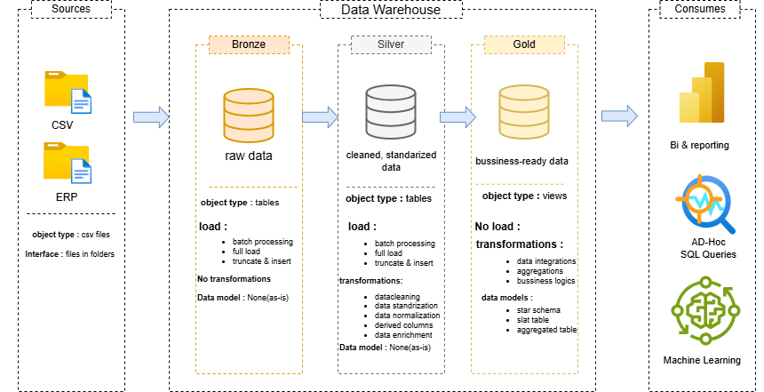

# Data Warehouse and Analytics Project

Welcome to the **Data Warehouse and Analytics Project** repository 🚀  
This project demonstrates an end-to-end data warehousing and analytics solution, from building a modern data warehouse to generating actionable insights using SQL.

Designed as a **portfolio project**, it showcases industry best practices in data engineering, data modeling, and analytics.

---

## 📘 Project Overview

This project involves:

1. **Data Architecture**  
   Designing a modern data warehouse using the **Medallion Architecture** (Bronze, Silver, and Gold layers).

2. **ETL Pipelines**  
   Extracting, transforming, and loading data from source systems into the data warehouse.

3. **Data Modeling**  
   Developing fact and dimension tables optimized for analytical queries.

4. **Analytics & Reporting**  
   Creating SQL-based analytical queries and reports to generate insights.

---

## 🎯 Key Skills Demonstrated

- SQL Development  
- Data Warehousing Concepts  
- ETL Pipeline Design  
- Data Modeling (Star Schema)  
- Analytical Querying  
- Business Insights Generation  

---

## 🛠️ Tools & Technologies

- SQL  
- Relational Databases  
- Data Warehouse Concepts  
- Git & GitHub

---

## 🏗️ Data Architecture
The data architecture for this project follows medallion archutecture bronze,silver and gold layers. 

### 1.Bronze : stores raw data from the source system Data is ingested from CSVfiles into SQL
servers.
### 2.Silver : this layer includes data cleaning,standardization and normalization processes to prepare data for
analysis.
### 3.Gold : Houses bussinesss ready data modeled into a star schema required for reporting and analytics.

## 👋 About Me

Hi, I’m Dudekula Sadeep, a final-year B.Tech student with a strong interest in data analytics.  
I am currently building hands-on SQL projects focused on data warehousing, exploratory data analysis (EDA), and advanced queries.

